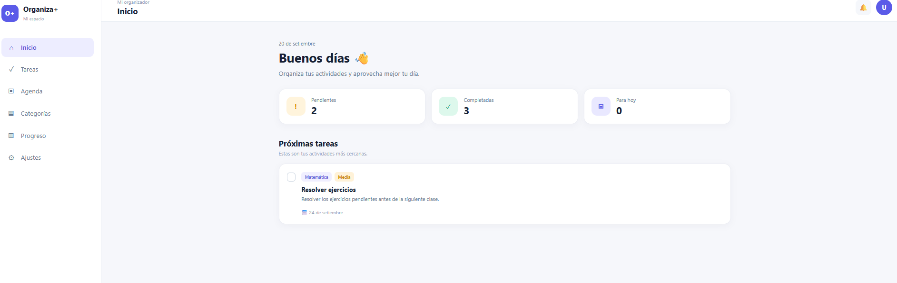
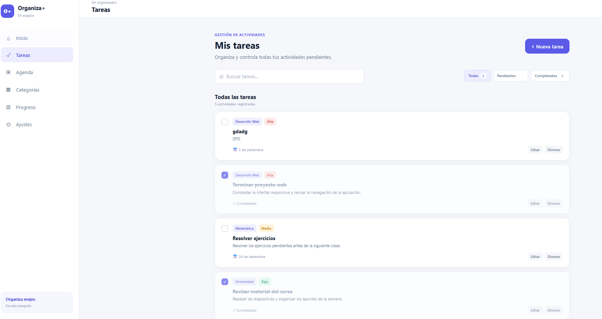
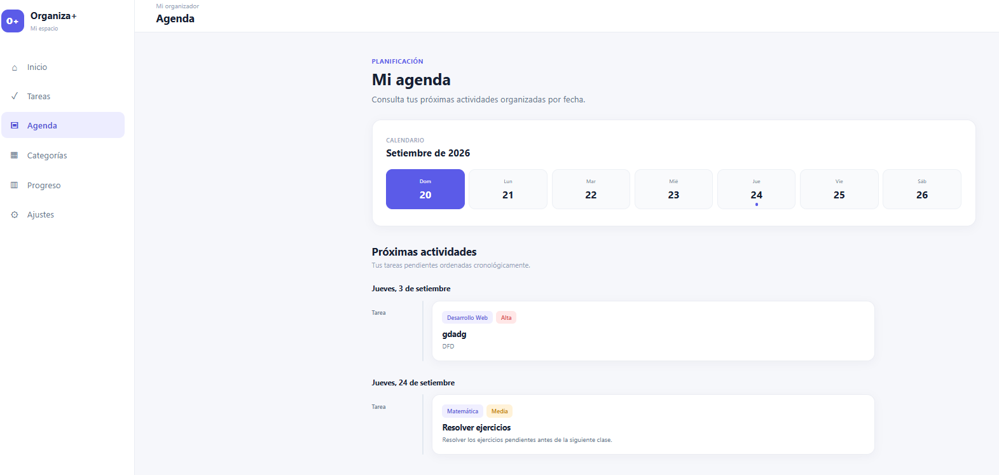
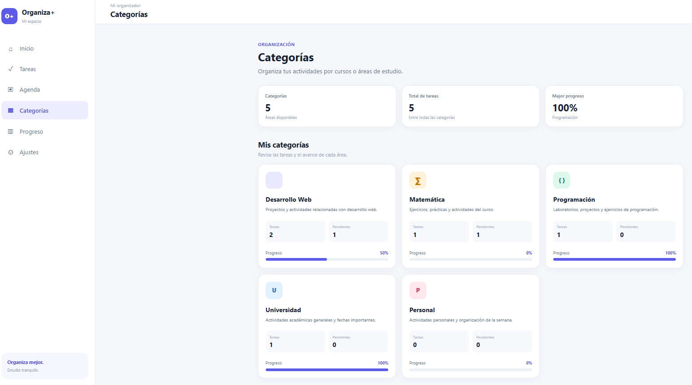
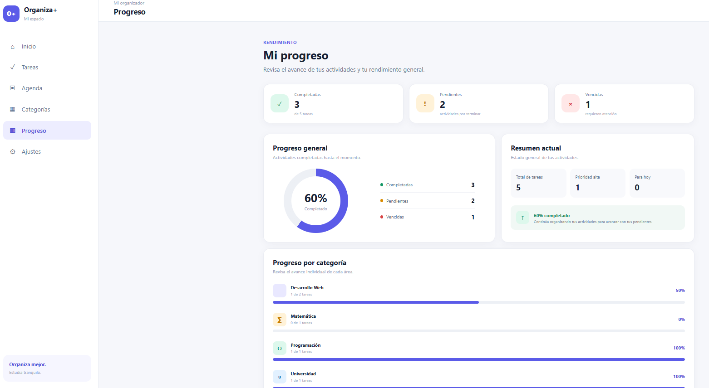
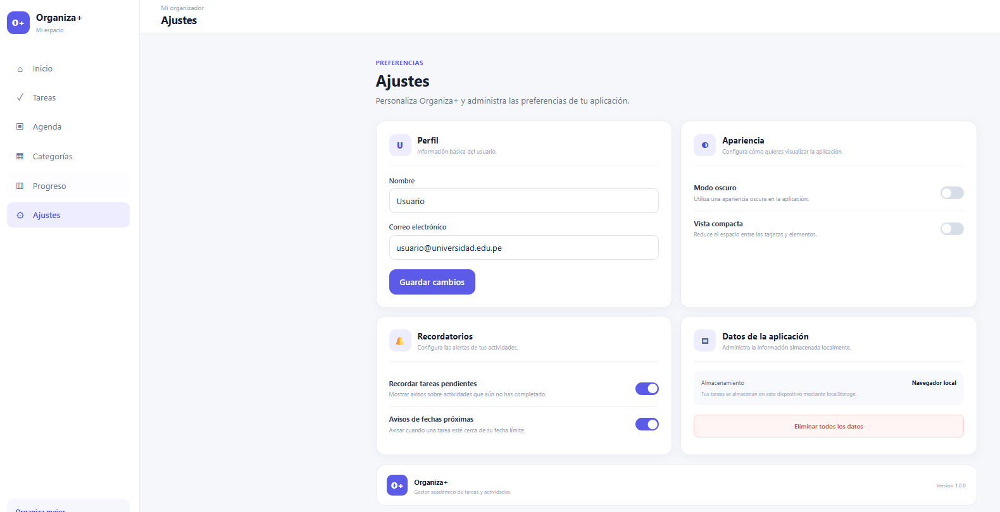
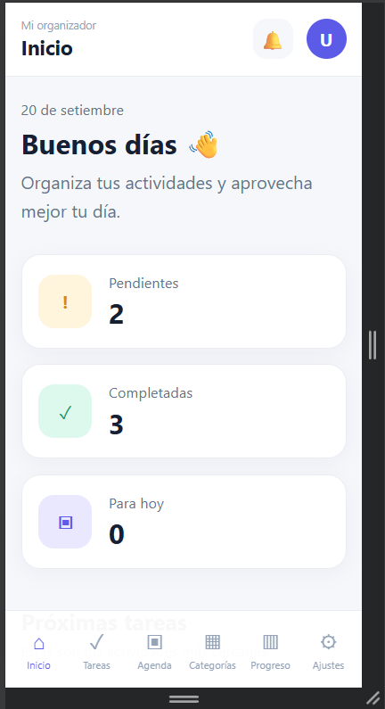

# # Organiza+ 📚

**Organiza+** es una aplicación web responsive orientada a estudiantes universitarios que permite organizar tareas, actividades académicas y fechas importantes desde una interfaz sencilla y adaptable a diferentes dispositivos.

El proyecto fue desarrollado como parte de una actividad académica enfocada en el desarrollo de interfaces web utilizando HTML, CSS y JavaScript.

---

## 📌 Objetivo del proyecto

Desarrollar una aplicación web responsive que permita gestionar actividades académicas de manera sencilla, utilizando JavaScript para generar y modificar información dinámicamente.

La aplicación busca facilitar la organización de tareas mediante categorías, prioridades, fechas límite y estadísticas de progreso.

---

## ✨ Funcionalidades

Organiza+ incluye las siguientes funcionalidades:

- Crear nuevas tareas.
- Editar tareas existentes.
- Eliminar tareas.
- Marcar tareas como completadas o pendientes.
- Buscar tareas por título, descripción o categoría.
- Filtrar tareas por estado.
- Organizar actividades por categorías.
- Visualizar próximas actividades en una agenda.
- Consultar estadísticas de progreso.
- Mostrar tareas vencidas, pendientes y completadas.
- Calcular el progreso general automáticamente.
- Guardar tareas utilizando `localStorage`.
- Mantener los datos después de actualizar o cerrar el navegador.
- Configurar nombre y correo del usuario.
- Activar modo oscuro.
- Activar vista compacta.
- Guardar preferencias de usuario.
- Restablecer los datos de la aplicación.
- Adaptarse a celulares, tablets y computadoras.

---

## 🖥️ Vistas de la aplicación

La aplicación cuenta con seis secciones principales:

### 🏠 Inicio

Muestra un resumen general de las actividades:

- tareas pendientes;
- tareas completadas;
- tareas para hoy;
- próximas actividades.

### ✅ Tareas

Permite gestionar las actividades académicas mediante operaciones de creación, edición, eliminación y cambio de estado.

También incluye buscador y filtros.

### 📅 Agenda

Organiza las tareas pendientes según su fecha límite y permite visualizar las próximas actividades.

### 🗂️ Categorías

Agrupa las tareas según diferentes áreas:

- Desarrollo Web
- Matemática
- Programación
- Universidad
- Personal

Cada categoría muestra automáticamente su cantidad de tareas, pendientes y porcentaje de progreso.

### 📊 Progreso

Presenta estadísticas generadas a partir de las tareas almacenadas:

- total de actividades;
- completadas;
- pendientes;
- vencidas;
- tareas de prioridad alta;
- tareas para hoy;
- porcentaje general de avance;
- progreso por categoría.

### ⚙️ Ajustes

Permite modificar preferencias de la aplicación:

- nombre;
- correo;
- modo oscuro;
- vista compacta;
- preferencias de recordatorios;
- eliminación de datos almacenados.

---

## 🛠️ Tecnologías utilizadas

El proyecto fue desarrollado utilizando:

- **HTML5** — estructura de la aplicación.
- **CSS3** — diseño y adaptación responsive.
- **JavaScript** — lógica y comportamiento dinámico.
- **Vite** — entorno de desarrollo y construcción.
- **LocalStorage** — almacenamiento local de tareas y preferencias.
- **Git** — control de versiones.
- **GitHub** — alojamiento del código fuente.

No se utilizaron frameworks de JavaScript ni librerías externas para desarrollar la funcionalidad principal.

---

## 📱 Diseño responsive

Organiza+ fue desarrollado siguiendo un enfoque **Mobile First**.

La interfaz se adapta a diferentes tamaños de pantalla:

- 📱 celulares;
- 📱 tablets;
- 💻 laptops;
- 🖥️ computadoras de escritorio.

En dispositivos pequeños se utiliza una navegación inferior, mientras que en pantallas grandes se muestra un menú lateral.

---

## 🗃️ Persistencia de datos

Las tareas y preferencias se almacenan mediante:

```text
localStorage
```

Esto permite conservar la información incluso después de actualizar la página o cerrar el navegador.

El flujo principal de datos es:

```text
Usuario
   ↓
Interfaz
   ↓
JavaScript
   ↓
Modelo de tareas
   ↓
localStorage
   ↓
Inicio / Tareas / Agenda / Categorías / Progreso
```

---

## 📂 Estructura del proyecto

```text
src/
├── assets/
│
├── js/
│   ├── views/
│   │   ├── homeView.js
│   │   ├── tasksView.js
│   │   ├── agendaView.js
│   │   ├── categoriesView.js
│   │   ├── statsView.js
│   │   └── settingsView.js
│   │
│   ├── categories.js
│   ├── router.js
│   ├── settings.js
│   ├── stats.js
│   ├── storage.js
│   ├── tasks.js
│   └── ui.js
│
├── styles/
│   ├── components.css
│   ├── main.css
│   └── responsive.css
│
└── main.js
```

La aplicación separa las vistas, la gestión de datos, el almacenamiento y los estilos para mantener una estructura organizada y facilitar su mantenimiento.

---

## 🔄 Funcionamiento general

La aplicación funciona como una interfaz de una sola página.

El archivo:

```text
router.js
```

se encarga de cambiar entre las diferentes vistas sin necesidad de recargar completamente el sitio.

Las tareas son administradas desde:

```text
tasks.js
```

mientras que:

```text
storage.js
```

se encarga de guardar y recuperar la información del navegador.

---
## 🚀 Instalación y ejecución

Para ejecutar el proyecto de forma local es necesario tener instalado:

- Node.js
- npm
- Git

### 1. Clonar el repositorio

Ejecutar:

```bash
git clone https://github.com/gsayag/GESTOR_TAREAS_UNI.git
```

Luego ingresar a la carpeta del proyecto:

```bash
cd GESTOR_TAREAS_UNI
```

### 2. Instalar las dependencias

Ejecutar:

```bash
npm install
```

Este comando instalará las dependencias necesarias definidas en `package.json`.

### 3. Ejecutar el proyecto

Iniciar el servidor de desarrollo con:

```bash
npm run dev
```

Vite mostrará una dirección similar a:

```text
http://localhost:5173
```

Abrir esa dirección en el navegador.

### 4. Generar versión de producción

Para generar una versión optimizada del proyecto:

```bash
npm run build
```

Los archivos finales se generarán dentro de:

```text
dist/
```

### 5. Previsualizar la versión de producción

Opcionalmente, se puede ejecutar:

```bash
npm run preview
```

Esto permite revisar localmente la versión generada para producción.

## 📸 Capturas de pantalla

### Inicio



### Gestión de tareas



### Agenda



### Organiza+



### Progreso



### Ajustes



### Vista responsive en celular



## 💾 Repositorio

Proyecto:

```text
GESTOR_TAREAS_UNI
```

El código fuente y el historial de versiones del proyecto se encuentran almacenados en GitHub.

---

## 👨‍💻 Desarrollo

Proyecto desarrollado con fines académicos como práctica de:

- diseño web responsive;
- manipulación del DOM;
- programación con JavaScript;
- almacenamiento local;
- organización modular del código;
- control de versiones con Git y GitHub.

---

## 📄 Versión

```text
Organiza+ v1.0.0
```